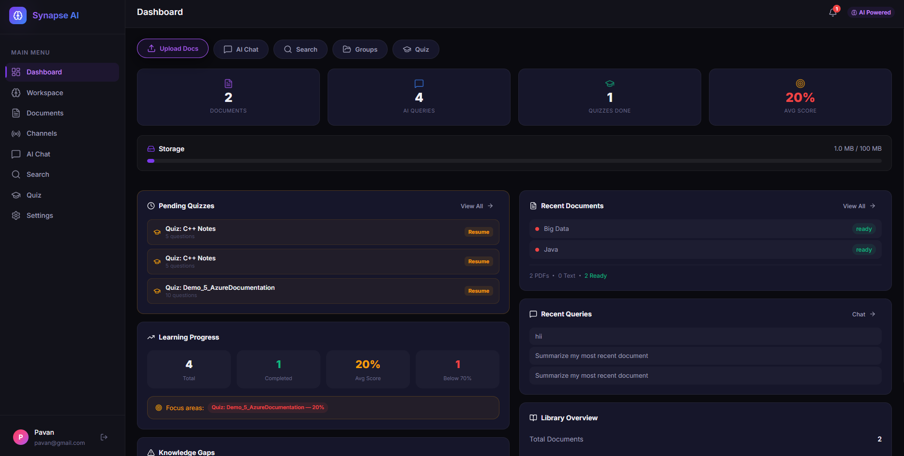
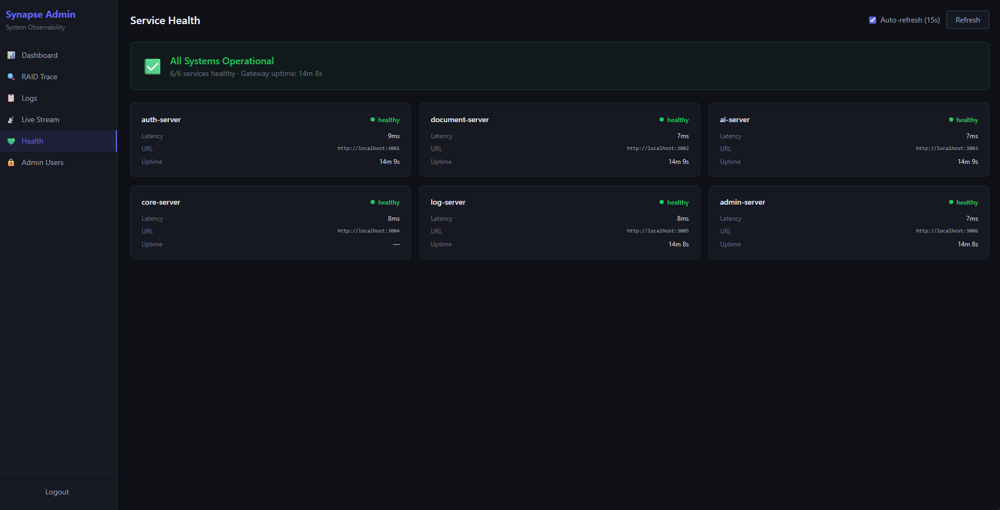

  # Synapse AI

  > **AI-Powered Collaborative Knowledge Workspace** — An enterprise-grade distributed microservices platform that transforms unstructured data into structured insights using Retrieval-Augmented Generation (RAG), real-time collaboration, event-driven architecture, and Azure cloud-native services.

  ---

  ## Table of Contents

  - [Overview](#overview)
  - [High-Level Architecture](#high-level-architecture)
  - [Microservice Design](#microservice-design)
  - [Deep AI Integration](#deep-ai-integration)
  - [Security Architecture](#security-architecture)
  - [Logging & Observability](#logging--observability)
  - [Real-Time Communication](#real-time-communication)
  - [Pub-Sub & Event-Driven Patterns](#pub-sub--event-driven-patterns)
  - [CDC — Change Data Capture](#cdc--change-data-capture)
  - [Circuit Breaker — Resilience](#circuit-breaker--resilience)
  - [RAID — Distributed Request Tracing](#raid--distributed-request-tracing)
  - [API Gateway — Reverse Proxy](#api-gateway--reverse-proxy)
  - [Frontend Applications](#frontend-applications)
  - [API Documentation](#api-documentation)
  - [Interface-Based Extensibility](#interface-based-extensibility)
  - [Tech Stack](#tech-stack)
  - [Quick Start](#quick-start)

  ---

  ## Overview

  Synapse AI is a production-grade platform composed of **7 independently deployable microservices**, two dedicated frontends (user-facing + admin observability dashboard), and a rich Azure-native data layer. The system enables users to:

  - **Upload & process documents** (PDF, Markdown, CSV) with automatic chunking, embedding, and vector indexing
  - **Query knowledge** via natural language with RAG-powered context-aware AI responses and source citations
  - **Collaborate in real-time** through shared workspaces with live chat, presence indicators, and multi-user document annotation
  - **Receive push notifications** through Azure Service Bus fan-out and Socket.IO delivery
  - **Generate AI quizzes** from document content with scoring and history tracking
  - **Perform semantic search** across the entire knowledge base with relevance scoring
  - **Monitor system health** via a dedicated admin dashboard with RAID tracing, live log streaming, and per-service health checks

  ---
  # Preview Images




**For more preview Images check the folder:** `PreviewImages`

**Youtube Link:** https://youtu.be/zUTwIrRE8MU?si=bFXxBVF7xUfkxHS6
  ---

  ## High-Level Architecture

  ```
  ┌────────────────────────────────────────────────────────────────────────────┐
  │                        Client Layer                                        │
  │                                                                            │
  │   ┌─────────────────────────────┐    ┌──────────────────────────────┐     │
  │   │  User Frontend              │    │  Admin Frontend               │     │
  │   │  React 19 + Vite (:5173)    │    │  React 19 + Vite + Tailwind  │     │
  │   │  11 pages │ Socket.IO       │    │  7 pages │ SSE Live Stream   │     │
  │   │  Voice │ TTS │ Notifications│    │  RAID Trace │ Health │ Logs  │     │
  │   └────────────┬────────────────┘    └──────────────┬───────────────┘     │
  │                │                                     │                     │
  │                └──────────┬──────────────────────────┘                     │
  │                           │ REST + WebSocket + SSE                         │
  └───────────────────────────┼────────────────────────────────────────────────┘
                              │
  ┌───────────────────────────▼────────────────────────────────────────────────┐
  │                  API Gateway (Express, :5001)                               │
  │                                                                            │
  │   ┌──────────┐ ┌──────────┐ ┌─────────────┐ ┌────────────┐ ┌──────────┐  │
  │   │ Helmet   │ │ Morgan   │ │ JWT Auth    │ │ Redis Rate │ │ Socket.IO│  │
  │   │ Security │ │ HTTP Log │ │ Validation  │ │ Limiter    │ │ + Redis  │  │
  │   │ Headers  │ │ Requests │ │ + s2sGuard  │ │ 200/min    │ │ Adapter  │  │
  │   └──────────┘ └──────────┘ └─────────────┘ └────────────┘ └──────────┘  │
  │                                                                            │
  │   http-proxy-middleware → Reverse proxy to all downstream services          │
  │   RequestContext → RAID (Request Activity ID) generation & propagation      │
  │                                                                            │
  │   Route Mapping:                                                           │
  │   /api/auth → :3001  │ /api/documents → :3002  │ /api/ai → :3003          │
  │   /api/quiz,groups,dashboard,notifications,channels → :3004                │
  │   /api/logs → :3005  │ /api/admin → :3006                                 │
  └───────────────────────────┬────────────────────────────────────────────────┘
                              │ x-internal-key (S2S Guard)
  ┌───────────────────────────▼────────────────────────────────────────────────┐
  │                       Backend Microservices                                 │
  │                                                                            │
  │  ┌──────────────┐  ┌──────────────┐  ┌──────────────┐  ┌──────────────┐  │
  │  │ Auth Server  │  │ Document     │  │ AI Server    │  │ Core Server  │  │
  │  │ :3001        │  │ Server :3002 │  │ :3003        │  │ :3004        │  │
  │  │              │  │              │  │              │  │              │  │
  │  │ Register     │  │ Upload/CRUD  │  │ RAG Engine   │  │ Workspaces   │  │
  │  │ Login + OTP  │  │ Bloom Filter │  │ Embeddings   │  │ Quiz Engine  │  │
  │  │ JWT + Refresh│  │ CDC Streams  │  │ Summarize    │  │ Dashboard    │  │
  │  │ Token Rotate │  │ Event Source │  │ Search       │  │ Notifications│  │
  │  │ Profile      │  │ SSE Events   │  │ Recommend    │  │ Channels     │  │
  │  │              │  │              │  │ AI Workers   │  │ Sharing      │  │
  │  │ Publisher:   │  │ Publisher:   │  │              │  │              │  │
  │  │ account-del  │  │ doc-events   │  │ Subscriber:  │  │ Subscriber:  │  │
  │  │              │  │ vec-cleanup  │  │ doc-events   │  │ doc-events   │  │
  │  │              │  │              │  │ acct-deleted │  │ notifications│  │
  │  └──────────────┘  └──────┬───────┘  └──────▲───────┘  │ acct-deleted│  │
  │                           │                 │          └──────────────┘  │
  │                    ┌──────▼─────────────────┤                            │
  │                    │   Azure Service Bus     │                            │
  │                    │   Topics + Subscriptions │                            │
  │                    │                          │                            │
  │                    │   document-events  ──────┤                            │
  │                    │   notifications    ──────┤                            │
  │                    │   collaboration    ──────┘                            │
  │                    └────────────────────────────┘                          │
  │                                                                            │
  │  ┌──────────────┐  ┌──────────────┐                                       │
  │  │ Log Server   │  │ Admin Server │                                       │
  │  │ :3005        │  │ :3006        │                                       │
  │  │              │  │              │                                       │
  │  │ Ingest Logs  │  │ Admin Auth   │                                       │
  │  │ RAID Trace   │  │ User Mgmt    │                                       │
  │  │ SSE Stream   │  │ OTP Verify   │                                       │
  │  │ Analytics    │  │ Bootstrap    │                                       │
  │  │ TTL Auto-    │  │              │                                       │
  │  │ Expiry (30d) │  │              │                                       │
  │  └──────────────┘  └──────────────┘                                       │
  │                                                                            │
  │  ──── GatewayBroadcaster ─────────────────────────────────────────────    │
  │  AI Server & Core Server emit events to Gateway via Socket.IO client       │
  │  Gateway relays to browser clients via Redis-backed Socket.IO rooms        │
  │  Rooms: user:{id} │ doc:{id} │ workspace:{id} │ channel:{id}              │
  └────────────────────────────────────────────────────────────────────────────┘
                              │
  ┌───────────────────────────▼────────────────────────────────────────────────┐
  │                          Data Layer                                        │
  │                                                                            │
  │   ┌──────────────┐   ┌──────────────────────┐   ┌─────────────────────┐  │
  │   │  MongoDB     │   │  Azure Cache for     │   │  Azure Cognitive    │  │
  │   │              │   │  Redis               │   │  Search             │  │
  │   │  Documents   │   │                      │   │                     │  │
  │   │  Users       │   │  Rate Limiting       │   │  HNSW Vector Index  │  │
  │   │  Workspaces  │   │  Socket.IO Adapter   │   │  1536-dim Embeddings│  │
  │   │  Quiz        │   │  Bloom Filter        │   │  Hybrid Search      │  │
  │   │  EventLog    │   │  Session Cache       │   │                     │  │
  │   │  LogEntries  │   │  Pub/Sub Backbone    │   │                     │  │
  │   │  Channels    │   │                      │   │                     │  │
  │   │  Notifs      │   │                      │   │                     │  │
  │   └──────────────┘   └──────────────────────┘   └─────────────────────┘  │
  └────────────────────────────────────────────────────────────────────────────┘
  ```

  ---

  ## Microservice Design

  The system follows a **strict microservice architecture** — each service is a fully independent Node.js + Express + TypeScript application with its own `package.json`, dependencies, models, and configuration. There are **no shared packages** between services; each is deployable in isolation.

  | Service | Port | Responsibilities |
  |---------|------|-----------------|
  | **API Gateway** | 5001 | Reverse proxy, JWT validation, Redis rate limiting, Socket.IO hub with Redis adapter, RAID generation, Helmet security, Morgan HTTP logging |
  | **Auth Server** | 3001 | User registration, login, email-based OTP verification, JWT access/refresh token issuance with rotation, profile management |
  | **Document Server** | 3002 | Document CRUD, multipart file upload, storage management (100 MB/user), CDC via MongoDB Change Streams, Event Sourcing (EventLog), Bloom filter deduplication, SSE broadcasting, Service Bus publisher |
  | **AI Server** | 3003 | RAG query engine, Azure OpenAI (GPT-4o) integration, embedding generation (1536-dim), vector store operations, document summarization, sentiment analysis, semantic search, content recommendations, async document processing workers, Service Bus subscriber |
  | **Core Server** | 3004 | Workspaces (collaborative groups), quiz generation/grading, dashboard analytics, notification delivery, channel management, document & workspace sharing, Service Bus subscriber/publisher, S2S client calls with circuit breakers |
  | **Log Server** | 3005 | Centralized log ingestion (single + batch), RAID trace reconstruction, SSE real-time log streaming, analytics aggregation, TTL auto-expiry (30 days) |
  | **Admin Server** | 3006 | Admin user authentication (OTP-verified), admin CRUD, bootstrap endpoint for initial setup, role-based admin management |

  ### OOP Folder Structure

  Every service follows a consistent, strict OOP structure:

  ```
  src/
  ├── server.ts              # Entry point, Express app bootstrap
  ├── config/                # Environment & service configuration
  ├── connections/           # MongoDB, Redis, Service Bus setup
  ├── constants/             # Enums, magic strings, config constants
  ├── Logger/                # ILogger, InternalLogger, LoggerService, DI wiring
  ├── middleware/             # Express middleware (auth, RAID, request logging, S2S guard)
  ├── models/                # Mongoose schemas & models
  ├── routes/                # Express route definitions (Swagger-documented)
  ├── utils/                 # Domain-specific service classes (one class per file)
  │   ├── ai/                #   AI service wrappers with retry logic
  │   ├── broadcast/         #   GatewayBroadcaster (Socket.IO client)
  │   ├── circuitbreaker/    #   Circuit breaker state machine
  │   ├── client/            #   Typed S2S HTTP clients
  │   ├── publisher/         #   IMessagePublisher implementations
  │   ├── subscriber/        #   IMessageSubscriber implementations
  │   ├── vectorstore/       #   IVectorStore (Azure Cognitive Search)
  │   ├── bloom/             #   Redis-backed Bloom filter
  │   ├── changestream/      #   MongoDB CDC wrappers
  │   └── ...                #   Other domain-specific classes
  └── workers/               # Background processing pipelines
  ```

  ---

  ## Deep AI Integration

  ### RAG (Retrieval-Augmented Generation) Pipeline

  The AI Server implements a full RAG pipeline powered by **Azure OpenAI (GPT-4o)** and **Azure Cognitive Search**:

  ```
  Document Upload                          User Query
        │                                       │
        ▼                                       ▼
  Text Extraction                        Embed Query
  (pdf-parse / raw)                    (1536-dim vector)
        │                                       │
        ▼                                       ▼
  Chunk Text                           Vector Search
  (300 words, 50-word overlap)     (HNSW top-K retrieval)
        │                                       │
        ▼                                       ▼
  Batch Embed Chunks               Build Context Window
  (20 chunks/batch)               (top 5 relevant chunks)
        │                                       │
        ▼                                       ▼
  Store in Azure                    Generate Answer
  Cognitive Search                (GPT-4o with sources)
  (HNSW index)                          │
                                        ▼
                                  Return with Citations
                                  (relevance scores + sources)
  ```

  ### AI Features

  | Feature | Description |
  |---------|-------------|
  | **RAG Query** | Context-aware Q&A with source citations and relevance scoring |
  | **Document Summarization** | Auto-generated summaries, key points, and tags upon upload |
  | **Semantic Search** | Meaning-based search across the vector index with match percentages (0–100%) |
  | **Content Generation** | Multi-document reports, executive summaries, comparative analysis |
  | **Quiz Generation** | AI-generated quizzes from document content with configurable question count and difficulty |
  | **Recommendations** | Related documents and follow-up query suggestions |
  | **Conversation Threading** | Multi-turn conversations with query history for contextual follow-ups |

  ### Azure OpenAI Configuration

  - **Chat Model**: GPT-4o with exponential backoff retry (3 attempts max)
  - **Embedding Model**: text-embedding-3 producing 1536-dimensional vectors
  - **Vector Index**: Azure Cognitive Search with HNSW algorithm, fields: `id`, `documentId`, `userId`, `title`, `chunkText`, `embedding`

  ### Document Processing Worker

  The `documentProcessor` worker runs asynchronously:
  1. Extract text (PDF via `pdf-parse`, Markdown/CSV as raw text)
  2. Generate summary, tags, and key points via GPT-4o
  3. Chunk text (300 words, 50-word overlap)
  4. Batch-embed chunks (20 per batch)
  5. Store vectors in Azure Cognitive Search
  6. Update MongoDB document status
  7. Broadcast real-time status to clients via GatewayBroadcaster

  ---

  ## Security Architecture

  ### Helmet — HTTP Security Headers

  Every service uses **Helmet** to set secure HTTP response headers out of the box:
  - Content Security Policy (CSP)
  - X-Content-Type-Options (nosniff)
  - X-Frame-Options (DENY)
  - Strict-Transport-Security
  - Referrer-Policy
  - X-XSS-Protection

  ### S2S Guard — Service-to-Service Authentication

  Only the API Gateway is publicly exposed. All downstream services are protected by the **`s2sGuard`** middleware, which validates the `x-internal-key` header on every inbound request:

  ```
  Browser → API Gateway (:5001) → [x-internal-key injected] → Backend Service
                                      │
                            s2sGuard validates header
                            against S2S_SECRET env var
                            Rejects if missing or mismatched
  ```

  External requests that bypass the gateway are rejected with `403 Forbidden`.

  ### JWT Authentication

  - **Access Tokens**: Signed with `JWT_SECRET`, 7-day expiry
  - **Refresh Tokens**: 30-day expiry with **token rotation** (invalidated on reissue)
  - **OTP Verification**: Email-based one-time password required before token issuance
  - The gateway validates JWTs and injects `x-user-id`, `x-user-email`, `x-user-name`, and `x-user-role` headers into proxied requests

  ### Rate Limiting

  The gateway enforces **200 requests/minute per user** using a **Token Bucket algorithm** backed by Azure Cache for Redis (`rate-limiter-flexible` + `ioredis`). This ensures rate limits are shared across all gateway instances in a horizontally scaled deployment.

  ### Idempotency & Dedup

  Document uploads use a **Bloom filter** (Redis-backed, 50,000 bits, 7 hash functions) for fast duplicate detection:
  ```
  idempotencyKey = SHA-256(userId + filename + fileSize)
  → Check Bloom filter (O(1)) → If positive, verify against DB
  → Prevents duplicate processing without expensive DB lookups every time
  ```

  ---

  ## Logging & Observability

  ### Three-Tier Logging Architecture

  The platform uses a layered logging approach combining **Morgan**, **Winston**, and a **custom distributed logger**:

  #### Tier 1 — Morgan (HTTP Request Logging)

  **Morgan** is configured on the API Gateway to log every inbound HTTP request with method, URL, status code, and response time. This provides a high-level audit trail of all external traffic entering the system.

  #### Tier 2 — Winston (Application-Level Logging)

  **Winston** is used as the general-purpose logger across all services for structured application-level messages — errors, warnings, business events, and debug info. Each service has its own Winston instance with JSON formatting and configurable log levels.

  #### Tier 3 — InternalLogger (Distributed Batch Logger)

  Every service includes a custom `InternalLogger` that implements the **flush-on-size-or-time** technique — a batch buffering strategy for efficient log delivery:

  ```
  ┌──────────────────────────────────────────────────────────────┐
  │                   InternalLogger                              │
  │                                                               │
  │   Log entries accumulate in an in-memory buffer               │
  │                                                               │
  │   Flush triggers:                                             │
  │   ├── SIZE: Buffer reaches 20 entries → immediate flush       │
  │   └── TIME: 5-second interval timer  → flush whatever exists  │
  │                                                               │
  │   Flush action:                                               │
  │   HTTP POST batch to Log Server (:3005) /api/logs             │
  │   with x-internal-key header for S2S authentication           │
  │                                                               │
  │   Failure handling:                                           │
  │   Fire-and-forget — console.error on failure, never crashes   │
  │   the host service. Lost logs are reported locally.           │
  └──────────────────────────────────────────────────────────────┘
  ```

  This **batch buffering & time-based flushing** approach minimizes network overhead (fewer HTTP calls) while ensuring logs are delivered within a bounded time window even under low-traffic conditions.

  #### Request Logger Middleware

  Every service includes a `requestLogger` middleware that automatically logs all HTTP request/response pairs with:
  - Method, path, status code, response time
  - RAID (Request Activity ID) for distributed trace correlation
  - User ID, IP address, User-Agent
  - Auto-categorized log levels: `info` (2xx), `warn` (4xx), `error` (5xx)

  ### Log Server Features

  The centralized Log Server (:3005) provides:

  | Feature | Description |
  |---------|-------------|
  | **Batch Ingestion** | Accepts up to 100 log entries per request with deduplication |
  | **RAID Trace** | Reconstructs full request path across services with per-service timeline and total duration |
  | **SSE Live Stream** | Real-time log streaming to the admin dashboard with 30-second heartbeat |
  | **Analytics** | Per-service and per-level log aggregation, error rate calculation |
  | **TTL Auto-Expiry** | MongoDB TTL index auto-deletes logs older than 30 days |
  | **Filtered Queries** | Filter by service, level, RAID, userId, date range, regex pattern |

  ### Swagger API Documentation

  Each API endpoint across all services is documented for **Swagger/OpenAPI**. Route definitions include request/response schemas, parameter descriptions, authentication requirements, and example payloads.

  ---

  ## Real-Time Communication

  ### Socket.IO with `@socket.io/redis-adapter`

  The API Gateway runs a **Socket.IO server** backed by the **`@socket.io/redis-adapter`**. This enables real-time event delivery across multiple gateway instances in a horizontally scaled deployment — when one gateway emits an event, all connected clients across all instances receive it.

  ```
  ┌─────────────┐     ┌─────────────┐     ┌─────────────┐
  │ Gateway #1  │     │ Gateway #2  │     │ Gateway #3  │
  │ Socket.IO   │◄───►│ Socket.IO   │◄───►│ Socket.IO   │
  └──────┬──────┘     └──────┬──────┘     └──────┬──────┘
        │                   │                   │
        └───────────┬───────┘───────────────────┘
                    │
          ┌─────────▼─────────┐
          │  Azure Cache for  │
          │  Redis (Pub/Sub)  │
          │                   │
          │  3 connections:   │
          │  primary, pub, sub│
          └───────────────────┘
  ```

  **RedisConnectionManager** maintains a singleton with three dedicated `ioredis` clients (`primary`, `publisher`, `subscriber`) for connection pooling, auto-connects on `getInstance()`, and cleanly disconnects on `SIGTERM`/`SIGINT`.

  ### GatewayBroadcaster Pattern

  Backend services (AI Server, Core Server, Document Server) that need to push real-time events to browser clients use the **GatewayBroadcaster** — a Socket.IO client that connects to the API Gateway and emits events into named rooms:

  ```
  AI Server (processing complete)
    │
    └─► GatewayBroadcaster.emit('doc:{docId}', 'doc:status', payload)
          │
          └─► API Gateway (Socket.IO server)
                │
                └─► All clients in room 'doc:{docId}'
  ```

  ### Room Structure

  | Room | Events | Purpose |
  |------|--------|---------|
  | `user:{userId}` | `notification`, `doc:shared`, `workspace:shared` | Per-user notifications and sharing alerts |
  | `doc:{documentId}` | `doc:status` | Document processing status (chunking, embedding, complete) |
  | `workspace:{workspaceId}` | `workspace:message`, `workspace:typing`, `workspace:presence` | Collaborative chat, typing indicators, online user presence |
  | `conversation:{conversationId}` | `conversation:message` | Shared AI conversation updates |
  | `channel:{channelId}` | `channel:*` | Channel posts, comments, likes, join requests |

  ---

  ## Pub-Sub & Event-Driven Patterns

  ### Azure Service Bus (Topics & Subscriptions)

  The system uses **Azure Service Bus** (Standard tier) as the asynchronous messaging backbone. Service Bus **Topics** enable fan-out to multiple subscribers — a single published event can trigger processing in multiple services simultaneously.

  ```
  ┌──────────────────┐         ┌───────────────────────────────────┐
  │ Document Server   │────────►│  Topic: document-events            │
  │ (Publisher)       │         │  ┌─ Subscription: ai-processing   │──► AI Server
  │                   │         │  └─ Subscription: notification    │──► Core Server
  └──────────────────┘         └───────────────────────────────────┘

  ┌──────────────────┐         ┌───────────────────────────────────┐
  │ Core Server       │────────►│  Topic: notifications              │
  │ (Publisher)       │         │  └─ Subscription: push-delivery   │──► Core Server
  └──────────────────┘         └───────────────────────────────────┘

  ┌──────────────────┐         ┌───────────────────────────────────┐
  │ Auth Server       │────────►│  Topic: account-deleted            │
  │ (Publisher)       │         │  ┌─ Subscription: doc-cleanup     │──► Document Server
  │                   │         │  ├─ Subscription: ai-cleanup      │──► AI Server
  │                   │         │  └─ Subscription: core-cleanup    │──► Core Server
  └──────────────────┘         └───────────────────────────────────┘
  ```

  ### Event Flow Example — Document Upload

  ```
  1. User uploads PDF via frontend
  2. Document Server stores file, creates Document record
  3. Document Server publishes "document-uploaded" to Service Bus (document-events topic)
  4. AI Server subscriber receives event → triggers document processing worker
    a. Extract text (pdf-parse)
    b. Generate summary + tags (GPT-4o)
    c. Chunk and embed (1536-dim vectors)
    d. Store in Azure Cognitive Search
    e. Broadcast status to frontend via GatewayBroadcaster
  5. Core Server subscriber receives same event → creates notification for user
  6. Notification delivered via Socket.IO to user's browser in real-time
  ```

  ### Interface-Based Pub/Sub

  All publishers and subscribers implement swappable interfaces:
  - **`IMessagePublisher`** — `publish(topic, message, label)`
  - **`IMessageSubscriber`** — `subscribe(topic, subscription, handler)`

  To swap Service Bus for another message broker (RabbitMQ, Kafka, etc.), implement the interface and replace the factory export — no other code changes required.

  ---

  ## CDC — Change Data Capture

  The Document Server implements **CDC via MongoDB Change Streams** to detect and broadcast real-time data changes without polling:

  ```
  MongoDB (Document Collection)
    │
    │  Change Stream watches: update, replace operations
    ▼
  ChangeStreamManager
    │
    ├──► Socket.IO broadcast to room 'doc:{docId}'
    │    (clients see status changes instantly)
    │
    └──► SSE broadcast to connected SSE clients
        (backward compatibility for non-WebSocket consumers)
  ```

  This enables the frontend to display real-time document processing status (uploading → processing → embedding → ready) without polling.

  ### Event Sourcing

  The Document Server maintains an immutable **EventLog** collection for full audit trail:
  - `DOCUMENT_UPLOADED`, `PROCESSING_STARTED`, `CONTENT_EXTRACTED`, `EMBEDDINGS_CREATED`, `PROCESSING_COMPLETE`, `DOCUMENT_DELETED`
  - Each event stores: `aggregateId`, `eventType`, `payload`, `userId`, `timestamp`
  - Enables compliance auditing, debugging, and potential event replay

  ---

  ## Circuit Breaker — Resilience

  The system implements the **Circuit Breaker pattern** on all service-to-service HTTP calls to prevent cascading failures across the microservice mesh:

  ```
  ┌────────────────────────────────────────────────────────────┐
  │                   Circuit Breaker States                    │
  │                                                            │
  │    CLOSED (normal)                                         │
  │      │ failure count exceeds threshold (5)                 │
  │      ▼                                                     │
  │    OPEN (rejecting all calls)                              │
  │      │ timeout expires (30 seconds)                        │
  │      ▼                                                     │
  │    HALF-OPEN (testing with limited traffic)                │
  │      │ 3 consecutive successes → CLOSED                   │
  │      │ any failure → back to OPEN                         │
  └────────────────────────────────────────────────────────────┘
  ```

  **Usage**: AI Server and Core Server wrap all S2S calls (to Document Server, AI Server, etc.) in circuit breakers. When a downstream service is unhealthy, the circuit opens immediately — callers receive fast-fail errors instead of hanging on timeouts, preventing thread pool exhaustion and cascading timeouts across the mesh.

  | Parameter | Value |
  |-----------|-------|
  | Failure Threshold | 5 consecutive failures to open |
  | Open Timeout | 30 seconds before testing |
  | Half-Open Successes | 3 successes to close |
  | Scope | Per-service (separate breaker per target service) |

  ---

  ## RAID — Distributed Request Tracing

  **RAID (Request Activity ID)** is the system's distributed tracing mechanism for tracking API behavior end-to-end across all microservices:

  ```
  Client Request
    │
    ▼
  API Gateway: RequestContext middleware
    ├── Extract x-raid header (if present) OR generate new UUID
    ├── Set x-raid on request headers
    ├── Set x-raid on response headers (returned to client)
    └── Propagate via http-proxy-middleware to downstream service
          │
          ▼
  Downstream Service: raidContext middleware
    ├── Extract x-raid from headers
    ├── Attach to request object
    └── Include in all logger calls
          │
          ▼
  Log Server: RAID Trace API
    ├── GET /api/logs/raid/:raid
    ├── Groups all logs by RAID
    ├── Calculates total request duration
    ├── Shows per-service timeline
    └── Flags errors in the trace
  ```

  **RAID Trace Output Example**:
  ```json
  {
    "raid": "550e8400-e29b-41d4-a716-446655440000",
    "totalLogs": 12,
    "services": ["api-gateway", "auth-server", "document-server", "ai-server"],
    "totalDurationMs": 2500,
    "hasErrors": false,
    "timeline": [
      { "service": "api-gateway", "path": "/api/documents/upload", "duration": 50 },
      { "service": "document-server", "action": "validate + save", "duration": 200 },
      { "service": "ai-server", "action": "process-document", "duration": 1150 }
    ]
  }
  ```

  The Admin Frontend provides a **RAID Trace Viewer** where administrators can search by RAID ID and see the full request path, per-service breakdown, and error flags.

  ---

  ## API Gateway — Reverse Proxy

  The API Gateway uses **`http-proxy-middleware`** to act as a reverse proxy for all client-facing requests. It is the single entry point to the system.

  ### Middleware Stack (Execution Order)

  ```
  1. Helmet         → Security headers (CSP, XSS, framing, referrer)
  2. CORS           → Cross-origin configuration
  3. Morgan         → HTTP request logging (method, url, status, time)
  4. Health Routes  → /health, /readiness (no auth, no proxy)
  5. Redis Adapter  → Attach @socket.io/redis-adapter for multi-instance
  6. Rate Limiter   → 200 req/min per user (Token Bucket via Redis)
  7. JWT Auth       → Validate Bearer token, inject x-user-* headers
  8. RequestContext → Generate/propagate RAID ID
  9. Request Logger → Log every request with RAID, user, timing
  10. Proxy Routes  → http-proxy-middleware forwards to backend services
  11. Error Handler → JSON error responses with logging
  ```

  ### Proxy Behavior

  When proxying, the gateway injects:
  - `x-internal-key` — S2S shared secret for downstream authentication
  - `x-raid` — Request Activity ID for distributed tracing
  - `x-user-id`, `x-user-email`, `x-user-name`, `x-user-role` — Extracted from validated JWT

  ---

  ## Frontend Applications

  ### User Frontend (React 19 + Vite)

  The main user-facing application with **11 pages**, built with React 19, TypeScript, Vite, and a **custom CSS design system** (no Tailwind — all styles use CSS custom properties in a dark-theme design):

  | Page | Features |
  |------|----------|
  | **Dashboard** | KPI cards (documents, queries, quizzes), storage usage, quick actions, AI recommendations |
  | **Documents** | Upload (PDF/MD/CSV), real-time status via WebSocket, sharing with user search, lazy loading |
  | **Document Detail** | Inline viewer, document-specific Q&A, TTS + voice input, sharing panel |
  | **Workspaces** | Collaborative groups, live chat with presence indicators, member roles, bulk document upload, report generation |
  | **AI Chat** | Multi-turn conversations, voice-to-text (Web Speech API), TTS, conversation sharing, source citations |
  | **Channels** | Community knowledge sharing, categories, posts (Markdown/PDF/YouTube), likes, comments, member management |
  | **Channel Detail** | Post viewer, embedded YouTube, like/dislike, threaded comments, join request workflow |
  | **Search** | Semantic search with relevance scores, color-coded match percentages, paginated results |
  | **Quiz** | Document selection → AI quiz generation → interactive answer UI → scoring & history |
  | **Settings** | TTS voice selection (gender filter), speech rate, username editing, account deletion |
  | **Login** | Register/Login toggle, OTP verification (6-digit), resend cooldown timer |

  **Real-Time**: Socket.IO client auto-connects on login, joins per-user rooms, handles document status updates, workspace presence, typing indicators, shared conversation messages, and push notifications with unread badge counter.

  ### Admin Frontend (React 19 + Vite + Tailwind CSS)

  A dedicated observability and administration dashboard with **7 pages**:

  | Page | Features |
  |------|----------|
  | **Dashboard** | System KPIs (total logs, error count, error rate, SSE clients), logs by service/level charts, time range selector |
  | **RAID Trace** | Search by RAID ID, recent RAIDs bar, service breakdown with collapsible logs, timeline visualization, error flagging |
  | **Logs** | Filterable log explorer (service, level, search), expandable rows with full metadata (RAID, user, method, IP, meta JSON), pagination (50/page) |
  | **Live Stream** | SSE-powered real-time log feed, pause/resume, filter by service/level, auto-scroll, max 200 entries with auto-trim, level-based color coding |
  | **Health** | Per-service health cards (status, uptime, response time, memory), auto-refresh (15s), overall system status banner |
  | **Admin Users** | Admin account list, role display, lock status, delete with confirmation |
  | **Login** | Two-factor admin auth (email + 8-digit OTP), session-based token in sessionStorage |

  ---

  ## API Documentation

  Each endpoint across all services is documented for Swagger. Below is a summary of the public API surface:

  ### Auth (`/api/auth`)
  | Method | Endpoint | Description |
  |--------|----------|-------------|
  | POST | `/register` | Register new user |
  | POST | `/login` | Login with credentials |
  | POST | `/verify-otp` | Verify OTP and receive JWT tokens |
  | POST | `/resend-otp` | Resend OTP code |
  | GET | `/profile` | Get authenticated user profile |
  | POST | `/refresh-token` | Rotate refresh token |

  ### Documents (`/api/documents`)
  | Method | Endpoint | Description |
  |--------|----------|-------------|
  | POST | `/upload` | Upload document (multipart, Bloom filter dedup) |
  | GET | `/` | List user's documents (paginated, filterable) |
  | GET | `/:id` | Get document by ID |
  | GET | `/:id/content` | Get document content chunks |
  | GET | `/user/storage` | Get user's storage usage |
  | GET | `/stream/:id` | SSE stream for document updates |
  | POST | `/:id/share` | Share document with another user |
  | DELETE | `/:id/share` | Unshare document |
  | DELETE | `/:id` | Delete document (cascades to vectors, content, groups) |

  ### AI (`/api/ai`)
  | Method | Endpoint | Description |
  |--------|----------|-------------|
  | POST | `/query` | RAG query with optional conversation threading |
  | POST | `/summarize` | Summarize text or document |
  | POST | `/generate` | Generate report or briefing |
  | GET | `/search?q=` | Semantic search across vector index |
  | GET | `/recommendations` | Content recommendations + follow-ups |

  ### Workspaces (`/api/groups`)
  | Method | Endpoint | Description |
  |--------|----------|-------------|
  | POST | `/` | Create workspace |
  | GET | `/` | List workspaces (owned + shared) |
  | GET | `/:id` | Get workspace with messages |
  | PUT | `/:id` | Update workspace (add documents) |
  | POST | `/:id/chat` | Chat with AI in workspace context |
  | POST | `/:id/share` | Share workspace with user (role: editor/viewer) |
  | DELETE | `/:id/members/:userId` | Remove member |
  | PATCH | `/:id/members/:userId/role` | Update member role |
  | GET | `/:id/messages` | Get paginated messages |
  | DELETE | `/:id` | Delete workspace (owner only) |

  ### Notifications (`/api/notifications`)
  | Method | Endpoint | Description |
  |--------|----------|-------------|
  | GET | `/` | List user notifications |
  | PATCH | `/:id/read` | Mark notification as read |
  | POST | `/read-all` | Mark all as read |

  ### Quiz (`/api/quiz`)
  | Method | Endpoint | Description |
  |--------|----------|-------------|
  | POST | `/generate` | Generate quiz from documents |
  | POST | `/:id/submit` | Submit quiz answers for grading |
  | GET | `/history` | Get quiz history with scores |
  | GET | `/:id` | Get quiz by ID |

  ### Logs (`/api/logs`)
  | Method | Endpoint | Description |
  |--------|----------|-------------|
  | POST | `/` | Ingest log entry or batch (max 100) |
  | GET | `/` | Query logs with filters |
  | GET | `/raid/:raid` | Full RAID trace reconstruction |
  | GET | `/stream` | SSE real-time log stream |
  | GET | `/stats` | Log analytics (counts, error rates) |
  | DELETE | `/` | Purge logs older than N days |

  ---

  ## Interface-Based Extensibility

  Every infrastructure dependency is behind a swappable interface:

  ```
  ┌─────────────────────┬──────────────────────┬────────────────────────┐
  │ Component           │ Interface            │ Default Implementation │
  ├─────────────────────┼──────────────────────┼────────────────────────┤
  │ Message Queue       │ IMessagePublisher    │ Azure Service Bus      │
  │                     │ IMessageSubscriber   │ Azure Service Bus      │
  │ AI / LLM Provider   │ AIProvider (abstract)│ Azure OpenAI (GPT-4o)  │
  │ Vector Store        │ IVectorStore         │ Azure Cognitive Search │
  │ Rate Limiter        │ RateLimiterAbstract  │ Redis Token Bucket     │
  │ Real-Time Broadcast │ IBroadcaster         │ Socket.IO Client       │
  │ Cache / Pub-Sub     │ ioredis              │ Azure Cache for Redis  │
  │ Logger              │ ILogger              │ InternalLogger (HTTP)  │
  └─────────────────────┴──────────────────────┴────────────────────────┘
  ```

  To swap any component, implement the corresponding interface and update the factory export. No other files require changes.

  ### Graceful Degradation

  | Component | Primary | Fallback |
  |-----------|---------|----------|
  | Rate Limiter | Redis (shared across instances) | In-memory (per-instance) |
  | Socket.IO | Redis adapter (multi-instance) | In-memory (single instance) |
  | Message Queue | Azure Service Bus | HTTP fire-and-forget |
  | Subscriber | Azure Service Bus | No-op (uses HTTP internal endpoints) |
  | Logger | HTTP batch to Log Server | Console.error (never crashes host) |

  ---

  ## Tech Stack

  | Layer | Technology |
  |-------|-----------|
  | **User Frontend** | React 19, TypeScript, Vite, React Router 7, Lucide Icons, Socket.IO Client, React Markdown, Web Speech API |
  | **Admin Frontend** | React 19, TypeScript, Vite, Tailwind CSS, React Router 7, SSE (EventSource) |
  | **Backend Runtime** | Node.js, Express, TypeScript, ts-node-dev |
  | **Database** | MongoDB (Mongoose ODM) |
  | **Cache & Pub/Sub** | Azure Cache for Redis (ioredis) — rate limiting, Socket.IO adapter, Bloom filter, session cache |
  | **Message Queue** | Azure Service Bus — Topics & Subscriptions for fan-out event delivery |
  | **Vector Store** | Azure Cognitive Search — HNSW index, 1536-dim embeddings, hybrid search |
  | **AI / LLM** | Azure OpenAI — GPT-4o (chat), text-embedding-3 (embeddings) |
  | **Authentication** | JWT (jsonwebtoken + bcryptjs), OTP email verification, token rotation |
  | **HTTP Security** | Helmet (CSP, XSS, framing, referrer policy, HSTS) |
  | **HTTP Logging** | Morgan (gateway request logging) |
  | **Application Logging** | Winston (structured JSON logs in all services) |
  | **Distributed Logging** | InternalLogger (batch buffer, flush-on-size-or-time to Log Server) |
  | **Real-Time** | Socket.IO + `@socket.io/redis-adapter` (multi-instance WebSocket hub) |
  | **Reverse Proxy** | `http-proxy-middleware` (Express-based API gateway) |
  | **Rate Limiting** | `rate-limiter-flexible` (Redis Token Bucket, 200 req/min) |
  | **Resilience** | Circuit Breaker (CLOSED → OPEN → HALF-OPEN state machine on S2S calls) |
  | **Tracing** | RAID (Request Activity ID) — UUID propagated via `x-raid` header across all services |
  | **Deduplication** | Redis-backed Bloom Filter (50K bits, 7 hash functions) for upload idempotency |
  | **CDC** | MongoDB Change Streams → Socket.IO + SSE broadcasting |
  | **Event Sourcing** | Immutable EventLog collection for audit compliance |
  | **File Processing** | `pdf-parse` (PDF), raw text (Markdown, CSV), `multer` (multipart uploads) |

  ---

  ## Quick Start

  ### Prerequisites

  - Node.js 18+
  - MongoDB (local or Atlas)
  - Azure Cache for Redis (or local Redis)
  - Azure Service Bus (Standard tier — Basic does not support Topics)
  - Azure OpenAI (GPT-4o + text-embedding-3)
  - Azure Cognitive Search

  ### 1. Install Dependencies

  ```bash
  # All backend services
  cd backend && npm run install:all

  # User frontend
  cd frontend && npm install

  # Admin frontend
  cd admin-frontend && npm install
  ```

  ### 2. Configure Environment

  Each service reads from its own `.env` file. Required variables:

  ```env
  # Database
  MONGODB_URI=mongodb://localhost:27017/synapse_ai

  # Redis (Azure Cache for Redis)
  REDIS_HOST=<your-redis>.redis.cache.windows.net
  REDIS_PORT=6380
  REDIS_PASSWORD=<your-redis-access-key>

  # Azure Service Bus
  AZURE_SERVICE_BUS_CONNECTION_STRING=Endpoint=sb://<your-bus>.servicebus.windows.net/;SharedAccessKeyName=...

  # Azure OpenAI
  AZURE_OPENAI_ENDPOINT=https://<your-resource>.openai.azure.com/
  AZURE_OPENAI_API_KEY=<your-key>

  # Azure Cognitive Search
  AZURE_SEARCH_ENDPOINT=https://<your-search>.search.windows.net
  AZURE_SEARCH_API_KEY=<your-key>

  # Auth
  JWT_SECRET=<your-jwt-secret>
  S2S_SECRET=<your-s2s-key>
  ```

  ### 3. Azure Service Bus Setup

  Create the following topics and subscriptions:

  | Topic | Subscription | Consumer |
  |-------|-------------|----------|
  | document-events | ai-processing | AI Server |
  | document-events | notification-fanout | Core Server |
  | notifications | push-delivery | Core Server |
  | collaboration | realtime-broadcast | Core Server |
  | account-deleted | doc-cleanup | Document Server |
  | account-deleted | ai-cleanup | AI Server |
  | account-deleted | core-cleanup | Core Server |

  ### 4. Start All Services

  ```bash
  # Option A — Start all 7 services concurrently (from backend/)
  cd backend && npm run dev

  # Option B — Start individually
  cd backend/log-server && npm run dev          # :3005
  cd backend/auth-server && npm run dev         # :3001
  cd backend/document-server && npm run dev     # :3002
  cd backend/ai-server && npm run dev           # :3003
  cd backend/core-server && npm run dev         # :3004
  cd backend/admin-server && npm run dev        # :3006
  cd backend/api-gateway-server && npm run dev  # :5001

  # Frontends
  cd frontend && npm run dev                    # :5173
  cd admin-frontend && npm run dev              # Admin UI
  ```

  ### 5. Open in Browser

  - **User App**: `http://localhost:5173`
  - **Admin Dashboard**: `http://localhost:5174` (or configured port)
  - **Gateway Health**: `http://localhost:5001/health`

  ---